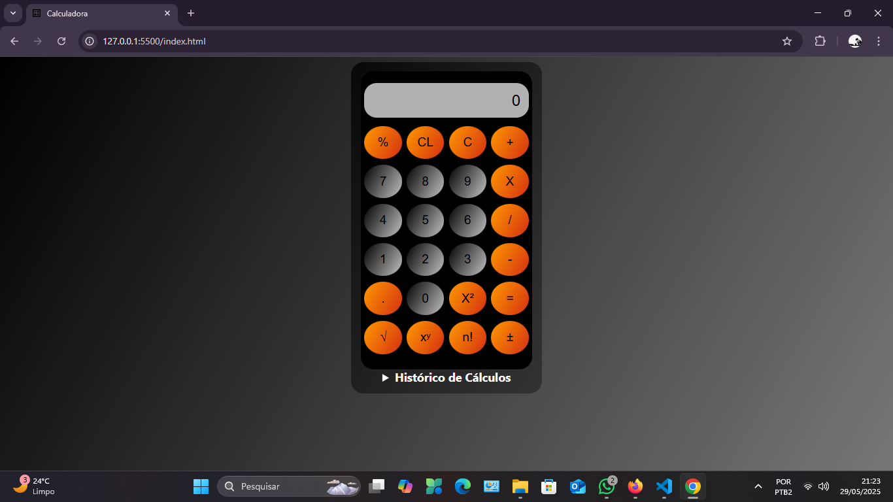
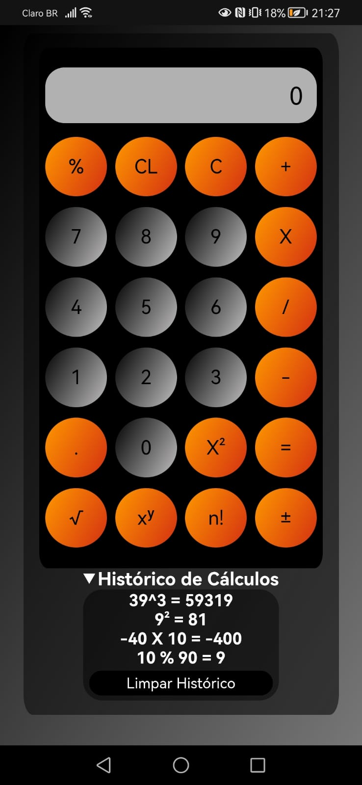

# 🧮 Calculadora

Este é um projeto desenvolvido em **HTML + CSS + JavaScript**, hospedado na **Vercel**, que oferece uma calculadora simples e funcional.  
Além de realizar as operações matemáticas básicas, a calculadora conta com um **histórico interativo**, **botão de correção** e um **design responsivo e amigável** para todas as telas.

---

## 📌 Funcionalidades

- ✅ Realiza as quatro operações básicas (adição, subtração, multiplicação e divisão)
- ✅ Histórico de cálculos exibido de forma clara e interativa
- ✅ Botão **C** que apaga um único caractere, facilitando correções
- ✅ Layout responsivo e adaptável (Mobile, Tablet e Desktop)
- ✅ Estilização moderna e acessível
- ✅ Deploy completo na Vercel

---

## 🧪 Tecnologias Utilizadas

| Ferramenta | Descrição |
|------------|-----------|
| [HTML5](https://developer.mozilla.org/pt-BR/docs/Web/HTML) | Estruturação semântica da página |
| [CSS3](https://developer.mozilla.org/pt-BR/docs/Web/CSS) | Estilização responsiva e moderna |
| [JavaScript](https://developer.mozilla.org/pt-BR/docs/Web/JavaScript) | Lógica das operações e interações |
| [Vercel](https://vercel.com/) | Plataforma de deploy automatizado |

---

## 🖼️ Layout

> 💻 Desktop | 📱 Mobile

| Desktop             | Mobile              |
|---------------------|---------------------|
<div align="center">
  
  
</div>

---

## 📦 Instalação Local

```
Clone o repositório

git clone https://github.com/seu-usuario/calculadora.git
cd calculadora
Execute localmente
Abra o arquivo index.html no navegador ou use um servidor local
```
## 🔒 Validação e Usabilidade

- Correção de números e operações com o botão **C**.
- Histórico de cálculos exibido em formato interativo para fácil consulta.
- Layout adaptável para diferentes tamanhos de tela.

---

## 🌐 Deploy na Vercel

[](https://calculadora-six-rosy.vercel.app/)

---

## 🤝 Contribuições

Contribuições são sempre bem-vindas!  
Se você tiver ideias para melhorar o projeto ou identificar bugs, sinta-se à vontade para abrir uma issue ou pull request.

---

## 👨‍💻 Autor

Desenvolvido por: **Anathyon Erysson**  
📫 anathyonerysson@protonmail.com  
🔗 [LinkedIn](https://www.linkedin.com/in/anathyonerysson/)
